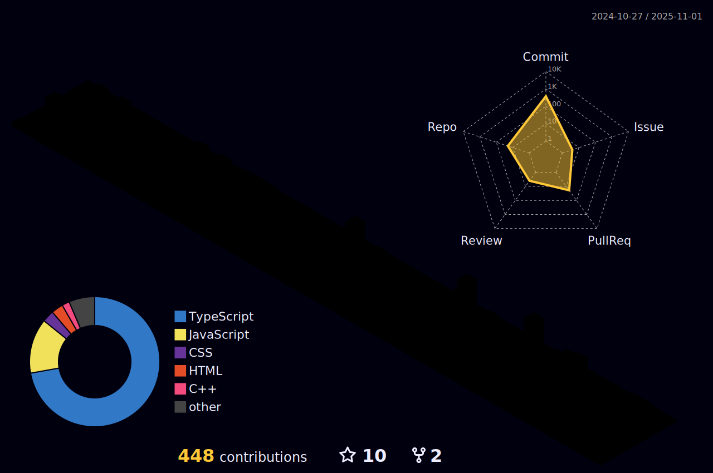

<h1 align="center">

</h1>

<h3 align="centre">"Mastering the art of frontend development: Empowering your designs."</h3>

###

- 🚀 I’m actively building and enhancing the Repositories and other innovative projects.

- 🌱 Always learning: diving deep into DevOps, Machine Learning, and the Full-Stack to expand my tech toolbox.

- 🤝 Open to collaborations—especially around latest repos and creative web projects. Let’s build something impactful together!

- 🧠 Interested in connecting with ML enthusiasts for model training, evaluation, and brainstorming new ideas.

- 💻 Explore all my coding adventures and repositories on my GitHub profile.

- 📬 Reach out: Email-**rudra17122005@gmail.com**—I love discussing tech, projects, or just geeking out!

- ⚡ Fun fact: Sometimes I get in the zone and just “vibe code”—music on, focus strong, creativity unleashed.

- ⚽ While tech has become my passion, my love for football still fuels my drive and teamwork.

<h3 align="center"> 🔗Connect with me </h3>

###

<h2 align="center"> ⚒️ Languages and Tools ⚒️</h2>

  
  
  
  
  
  
  
  
  
  
  
  
  
  
  
  
  
  
  
  
  
  
  
  
  
  
  
  
  
  
  
  
  
  
  

###

<h2 align="center">⚡ Stats ⚡</h2>
 

###

###

  

 

 

